Sysvinit 项目测试案例分析
=========================

测试 sysvinit 项目编译安装
-------------------------

### wget下载源码包
	$ wget http://download.savannah.gnu.org/releases/sysvinit/sysvinit-latest.tar.bz2
	
可以看到当前目录下有一个 sysvinit-latest.tar.bz2 的文件

### tar解压源码包
	$ tar jxvf sysvinit-latest.tar.bz2 

可以看到当前目录下生成了一个 sysvinit-2.88dsf 的目录

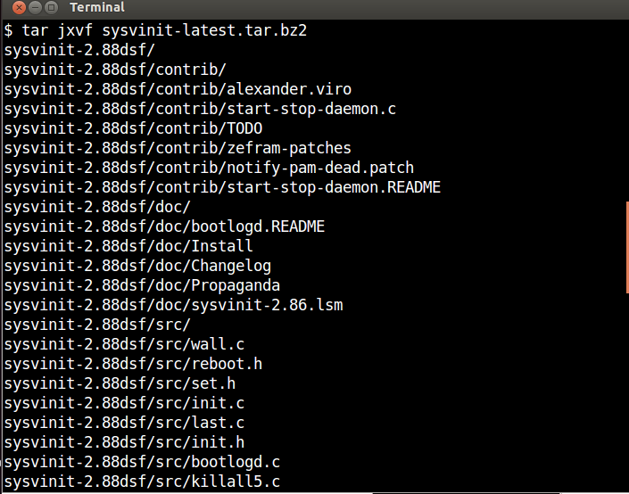

### 修改 Makefile

	增添11行的 CC=gcc，注释掉 13，14行有关 CFLAGS 的定义，否则编译会出很多的警告错误。

		$ vi Makefile 

		10 
		11 CC=gcc
		12 CPPFLAGS =
		13 #CFLAGS ?= -ansi -O2 -fomit-frame-pointer
		14 #override CFLAGS += -W -Wall -D_GNU_SOURCE -DDEBUG
		15 override CFLAGS += -D_GNU_SOURCE -DDEBUG
		16 STATIC  =
		17 
		...

	在80行处添加83行处的赋值，增加链接时 -lcrypt 选项

		80 SULOGINLIBS     += -lcrypt
		81 # Additional libs for GNU libc.
		82 ifneq ($(wildcard /usr/lib*/libcrypt.a),)
		83   SULOGINLIBS   += -lcrypt
		84 endif
		85 
		86 all:            $(BIN) $(SBIN) $(USRBIN)
		87 
		88 #%: %.o
		89 #       $(CC) $(CFLAGS) $(LDFLAGS) -o $@ $^ $(LDLIBS)
		90 #%.o: %.c
		91 #       $(CC) $(CFLAGS) $(CPPFLAGS) -c $^ -o $@

### 编译项目源码

	$ cd sysvinit-2.88dsf/
	$ make

编译无警告和错误信息。

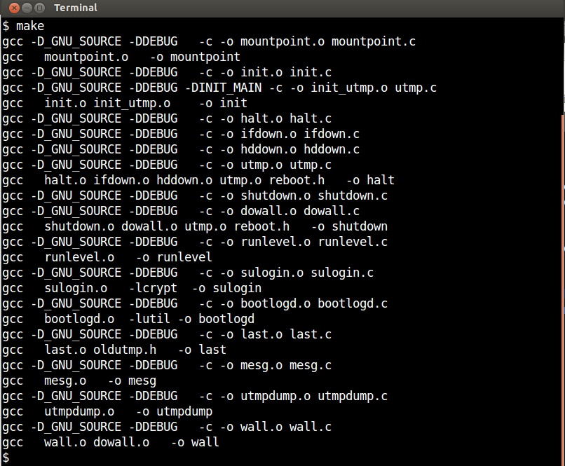

### 查看生成的可执行文件

	$ ls -l | grep "x "

在 src 目录下生成了十几个可执行文件，包括 init, halt, shutdown, killall5, runlevel, mesg 等。

测试 init 0 进入关机模式
-------------------------

### 运行 runlevel 命令查看当前级别

	$ runlevel
	N 2

N 表示之前的运行级别未知，2 是当前运行级别

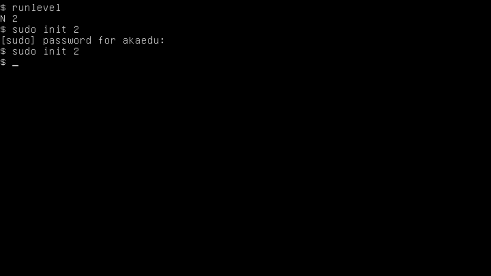

### 执行切换运行级别到同样的级别

	$ sudo init 2
	$ 

如果切换的是相同的运行级别，则不做任何工作。

### 切换到 0 级别，表示要关闭系统

	$ sudo init 0

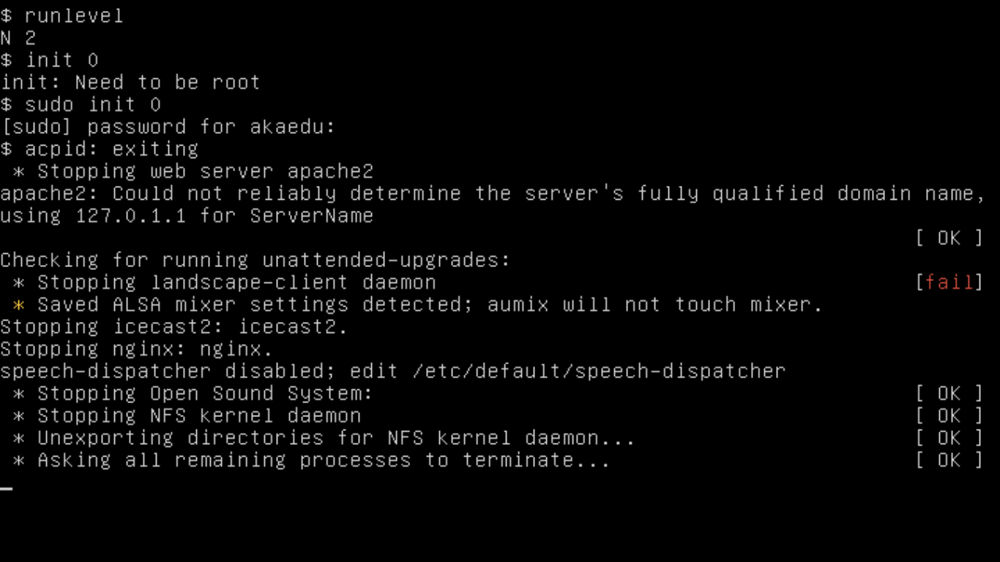

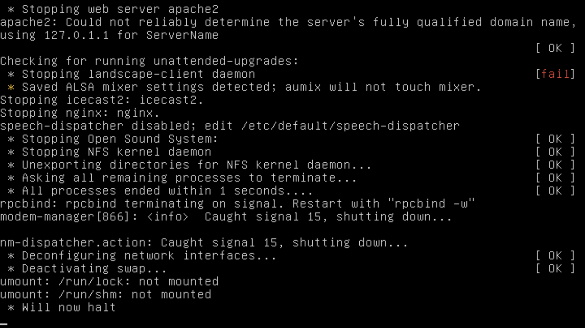

运行结束时，显示 * will now halt 

测试 init 1 进入单用户模式
-------------------------

### 切换到 1 级别，表示要进入单用户模式
	$ sudo init 0

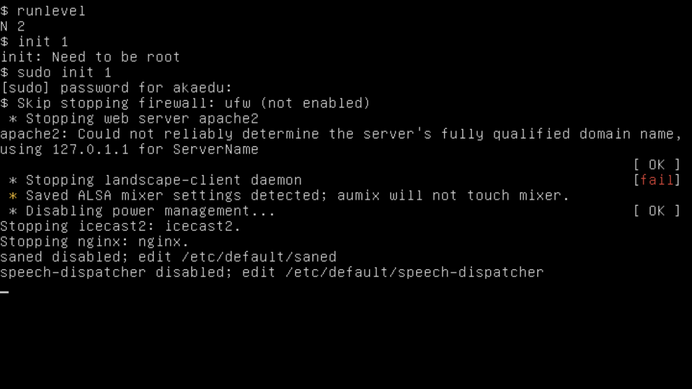
	
运行结束时，显示要求输入 root 密码来进行维护
	
	Give root password for maintenance
	(or type Control-D to continues): 

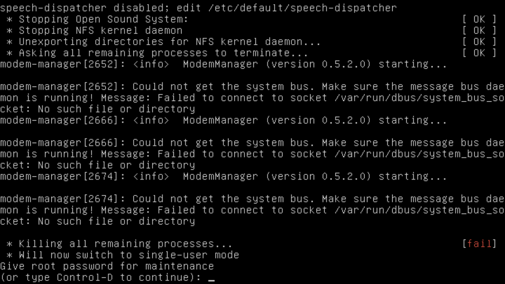

此时输入密码，可以进入到单用户模式
	
	root@ubuntu:~# 

	root@ubuntu:~# pwd
	/root

此时查看用户所在的主目录，已经变成是 /root 目录
	
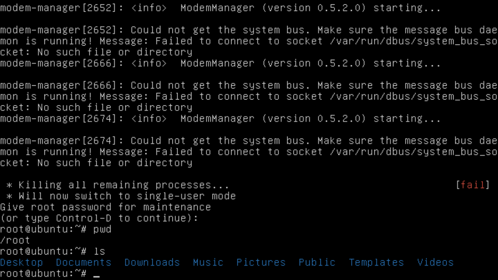

此时输入 whoami 命令，显示当前登录用户

	root@ubuntu:~# whoami
	root

查看当前用户，可以看到是 root 用户

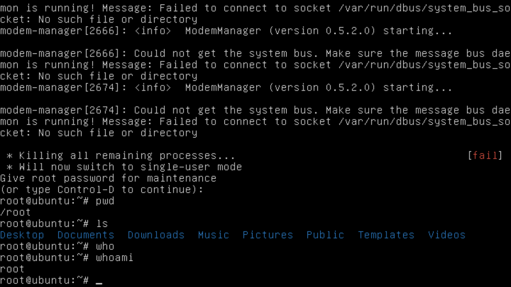

测试 init N 的其他模式
-------------------------

### 切换到 6 级别，表示要进入 reboot 模式

	$ sudo init 6

可以看到最后打印输出的提示信息，显示 * Will now restart 

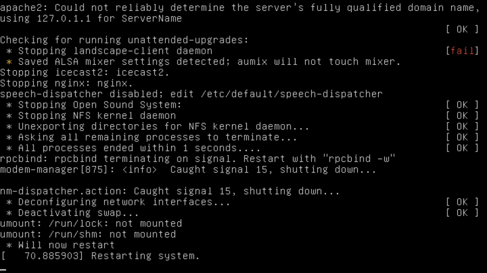

### 切换到 S 级别，表示要进入单用户模式
	
	$ sudo init S

可以看到最后打印输出的提示信息，要求输入 root 密码，登录后显示提示符： ～#

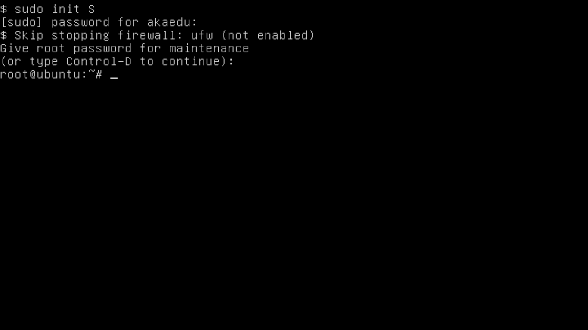

### 切换到 5 级别，表示要进入其他模式

	$ sudo init 5

可以发现运行到最后，其他模式暂时不支持，因此无法输入。

测试 shutdown 命令
-------------------------

### 测试 shutdown -k now 参数
	
	$ sudo shutdown -k now

可以看到最后只是打印信息，并没有真正执行关机命令。

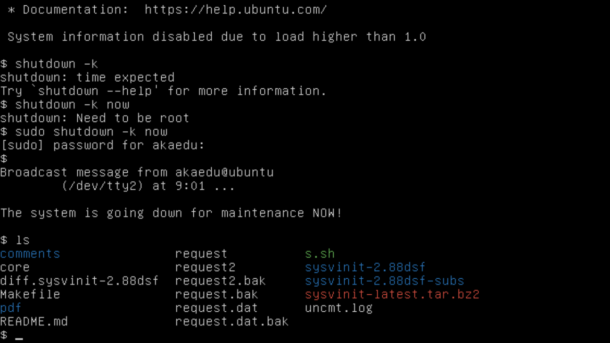

### 测试 shutdown -h now 参数

	$ sudo shutdown -h now

可以看到立即关机命令，最后提示 * Will now halt 

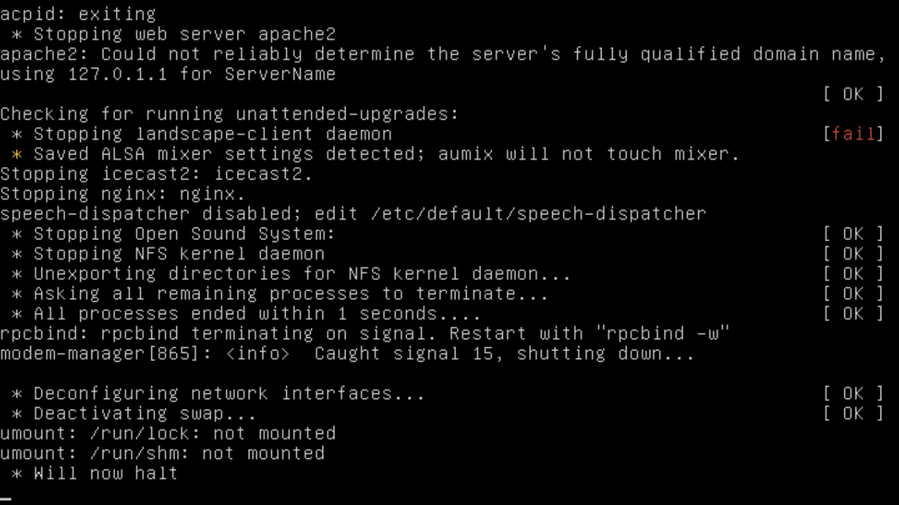

### 测试 shutdown -n now 参数
-n 不调用init程序关机，而是由shutdown自己进行(一般关机程序是由shutdown调用init来实现关机动作)，使用此参数将加快关机速度，但是不建议用户使用此种关机方式。

	$ sudo shutdown -n now

可以看到立即关机命令，最后并没有关机，而是进入到系统维护模式下（root单用户模式）。

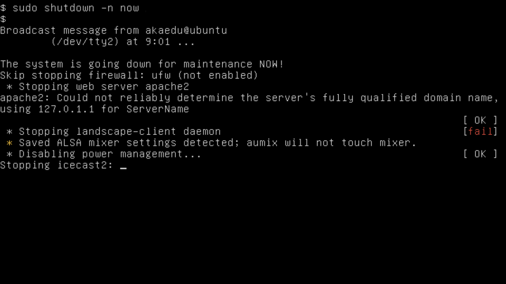

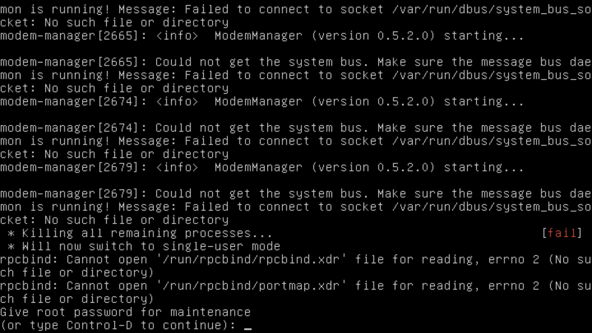

### 测试 shutdown -r now 参数

	$ sudo shutdown -r now

可以看到 -r 参数表示 reboot ，系统重新启动。

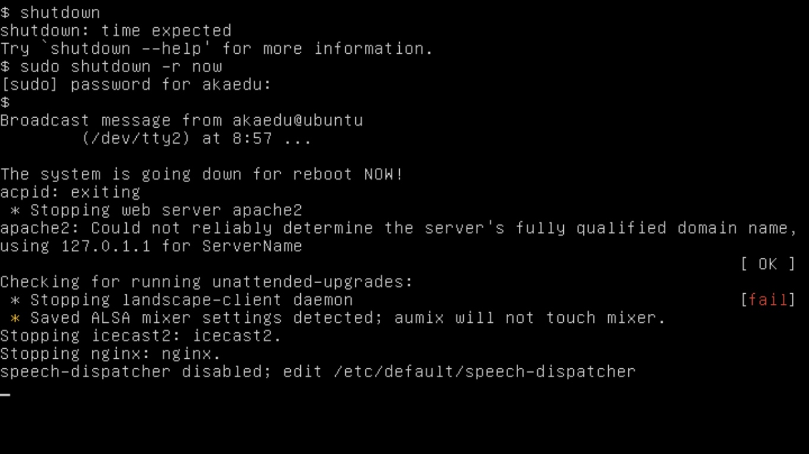

测试 poweroff 命令
-------------------------

### 测试 poweroff 命令，不带参数

	$ sudo poweroff

可以看到 poweroff 关机命令执行，最后系统关闭。

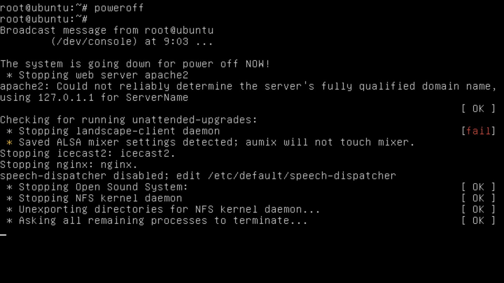

### 测试 poweroff -p 命令

	$ sudo poweroff -p

可以看到 poweroff -p 关机命令执行，最后显示 Power down 

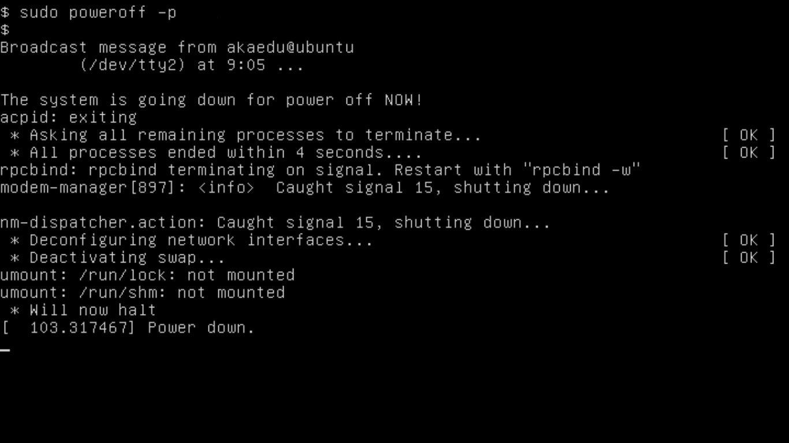

测试 reboot 命令
-------------------------

### 测试 reboot 命令，不带参数

	$ sudo reboot

可以看到 reboot 命令执行，最后显示 * Will now restart 系统完成重启。

测试 wall 命令
-------------------------

### 编译 sysvinit 项目获得可执行文件 wall
	$ cd sysvinit-2.88dsf/
	$ make
	make -C src all
	make[1]: Entering directory `/home/akaedu/Github/sysvinit/sysvinit-2.88dsf/src'
	make[1]: Nothing to be done for `all'.
	make[1]: Leaving directory `/home/akaedu/Github/sysvinit/sysvinit-2.88dsf/src'
	$ ls src/wall -l
	-rwxrwxr-x 1 akaedu akaedu 13243 Jun 22 14:49 src/wall
	$ 

查看 src 目录下已经生成 wall 命令。

### 执行 wall 命令加消息参数
	$ src/wall "hello msg"
	$ 
	Broadcast message from akaedu@ubuntu (pts/1) (Sun Jun 23 08:59:32 2013):

	hello msg

能够看到有广播的消息显示在终端窗口。

### 打开新的 Terminal 窗口，再次执行该命令
	$ 
	Broadcast message from akaedu@ubuntu (pts/1) (Sun Jun 23 09:00:36 2013):

	hello msg

此时，新打开的终端窗口也能够看到有广播的消息显示出来。

测试 mesg 命令
-------------------------

### 使用 tty 命令查看终端名称 tty
	$ tty
	/dev/pts/1
	$ 

获得终端名称 pts/1

### 使用 who 命令查看当前登录用户名 user
	$ who
	akaedu   tty2         2013-06-22 18:44
	akaedu   pts/1        2013-06-22 18:45 (:0.0)
	$ 

### 使用 write 命令给当前终端发消息
	$ write akaedu pts/1

	Message from akaedu@ubuntu on pts/1 at 09:13 ...
	hello msg
	hello msg
	test write cmd
	test write cmd
	EOF
	$ 

可以看到 write 命令能够实现自己给自己当前的终端发消息。按 ctrl+d 结束输入。

### 使用 mesg n 禁止消息接收功能
	$ mesg n
	$ write akaedu pts/1
	write: write: you have write permission turned off.

	write: akaedu has messages disabled on pts/1

可以看到当前终端如果使用 mesg n 命令之后，就不再接收 write 发来的消息。但如果用 wall 命令发送仍然可以接收。

write 也支持给其他终端发消息，做法是打开新的 Terminal 窗口，同样需要查看登录用户名和终端名称。
	

测试 killall5 命令
-------------------------

### 打开3个终端窗口
	$ (ctrl+alt+f1) 三个键同时按下

	$ (ctrl+alt+f2)

	$ (ctrl+alt+f3)

### 选择第2个和第3个输入某个命令
	(ctrl+alt+f2 选择2号窗口)
	$ ls

	(ctrl+alt+f3 选择3号窗口)
	$ cat

### 切换到第1个窗口，运行 killall5 命令
	$ ./src/killall5 

此时切换回刚才的两个窗口，发现都已经退出，重新回到登录界面，等待输入用户名和密码。

其他进程收到 kill 命令后，都被杀死，只有当前终端窗口仍然可以工作。

注： 不能在 X 窗口的终端里面测试该命令，会造成黑屏，无法恢复。

### 测试 -o 选项
	$ ./src/killall5 -o 2640

测试 pidof 命令
-------------------------

### pidof 命令直接跟进程名称
	$ pidof bash
	3023 2213
	$ ps aux | grep bash
	akaedu    2213  0.1  0.1  11412   972 tty2     S    16:11   0:01 -bash
	akaedu    3023  0.0  0.8   8192  4276 pts/2    Ss   16:12   0:00 bash
	akaedu    3383  0.0  0.1   4388   840 pts/2    S+   16:23   0:00 grep --color=auto bash
	$ 

### pidof 命令加 -s 参数
	$ pidof -s bash
	3023
	$ 

### pidof 命令和 kill 联合使用杀死进程
	$ 打开一个 Terminal 窗口启动一个 vim 程序
	$ 回到原来的窗口运行 pidof 命令
	$ pidof vim
	3471
	$ pidof vim | xargs kill

切换到刚才的新窗口，查看 vim 进程已经被杀死

	$ vim
	Vim: Caught deadly signal TERM
	Vim: Finished.

	Terminated
	$ 

测试 mountpoint 命令
-------------------------

### 查看一个目录是否为一个挂载点
	$ df
	Filesystem     1K-blocks    Used Available Use% Mounted on
	/dev/sda1        9928244 8427228   1002996  90% /
	udev              245968       4    245964   1% /dev
	tmpfs             101416     976    100440   1% /run
	none                5120       0      5120   0% /run/lock
	none              253536     260    253276   1% /run/shm
	$ src/mountpoint /
	/ is a mountpoint
	$ src/mountpoint /dev
	/dev is a mountpoint
	$ src/mountpoint /bin
	/bin is not a mountpoint
	$ src/mountpoint /home
	/home is not a mountpoint
	$ 

### 查看某个文件系统的主/从设备号：
	$ df
	Filesystem     1K-blocks    Used Available Use% Mounted on
	/dev/sda1        9928244 8427232   1002992  90% /
	udev              245968       4    245964   1% /dev
	tmpfs             101416     976    100440   1% /run
	none                5120       0      5120   0% /run/lock
	none              253536     260    253276   1% /run/shm
	$ src/mountpoint -d /
	8:1
	$ ls -l /dev/sda1
	brw-rw---- 1 root disk 8, 1 Jun 24 16:10 /dev/sda1
	$ 

### 不打印输出任何信息
	$ src/mountpoint -q /
	$ 

测试 runlevel 命令
-------------------------

### 查看当前运行级别
	$ runlevel -v
	N 2
	$ 

测试 sulogin 命令
-------------------------

### 以超级用户登录
	$ sulogin 
	sulogin: only root can run sulogin.
	$ sudo sulogin 
	[sudo] password for akaedu: 
	root@ubuntu:~# ls
	Desktop  Documents  Downloads  Music  Pictures  Public  Templates  Videos
	root@ubuntu:~# pwd
	/root
	root@ubuntu:~# 

测试 /proc 文件系统命令
-------------------------

### 查看 smbd 的进程号

	$ ps aux |grep smb
	root       845  0.0  0.2  21404  1156 ?        Ss   Jun27   0:02 smbd -F
	root       859  0.0  0.0  21508   156 ?        S    Jun27   0:00 smbd -F
	akaedu   32393  0.0  0.1   4388   840 pts/1    S+   08:54   0:00 grep --color=auto smb

### 查看 proc 文件系统中相关进程信息

	$ sudo cat /proc/845/stat
	845 (smbd) S 1 845 845 0 -1 4202752 22500 308803 1868 2976 60 237 105 662 20 0 1 0 652 21917696 289 4294967295 3068432384 3078609744 3214059904 3214058768 3068290084 0 6272 0 83553 3239400174 0 0 17 0 0 0 383 0 0
	$ 

	$ sudo cat /proc/845/cmdline 
	smbd-F$
	
### 使用 stat 查看文件节点信息

	$ stat /proc/845/exe
	  File: `/proc/845/exe'stat: cannot read symbolic link `/proc/845/exe': Permission denied
	  Size: 0         	Blocks: 0          IO Block: 1024   symbolic link
	Device: 3h/3d	Inode: 209481      Links: 1
	Access: (0777/lrwxrwxrwx)  Uid: (    0/    root)   Gid: (    0/    root)
	Access: 2013-06-28 08:54:40.836988876 +0800
	Modify: 2013-06-28 08:54:28.644988994 +0800
	Change: 2013-06-28 08:54:28.644988994 +0800
	 Birth: -
	$ 

测试 pidof 命令
-------------------------

### 使用 pidof 查看进程号

	$ pidof smbd
	859 845
	$ 

### 使用 -o omitpid 过滤进程

	$ pidof -o 845 smbd
	859
	$ 

### 使用完整路径名

	$ ps aux | grep smbd
	root       845  0.0  0.2  21404  1212 ?        Ss   Jun27   0:03 smbd -F
	root       859  0.0  0.0  21508   376 ?        S    Jun27   0:00 smbd -F
	akaedu    2356  0.0  0.1   4388   836 pts/0    S+   14:58   0:00 grep --color=auto smbd
	$ 

	$ pidof /bin/smbd
	859 845
	$ pidof /sbin/smbd
	859 845
	$ pidof /etc/smbd
	859 845
	$ 

可以看到 即使传入参数中有路径，也不影响输出结果，都能够实现匹配

### 测试进程名称中有路径的情况

	$ ps aux | grep sh
	akaedu   16768  0.0  0.0   2232     4 tty2     S+   Jun27   0:00 /bin/sh /usr/bin/startx
	akaedu   16818  0.0  0.0      0     0 tty2     Z    Jun27   0:00 [sh] <defunct>

	$ pidof sh
	16818 16768
	$ pidof /sbin/sh
	16818
	$ 

可以看到，如果进程名称中有路径，则只能匹配一个。

测试 last 命令
-------------------------

### 直接运行 last 命令
	 $ last | head
	akaedu   pts/4        :0.0             Sat Jun 29 18:13   still logged in   
	reboot   system boot  3.2.0-29-generic Sat Jun 29 16:43 - 16:43  (00:00)    
	reboot   system boot  3.2.0-29-generic Sat Jun 29 16:36 - 16:36  (00:00)    
	reboot   system boot  3.2.0-29-generic Sat Jun 29 16:33 - 16:33  (00:00)    
	reboot   system boot  3.2.0-29-generic Sat Jun 29 16:32 - 16:32  (00:00)    
	reboot   system boot  3.2.0-29-generic Sat Jun 29 16:31 - 16:31  (00:00)    
	reboot   system boot  3.2.0-29-generic Sat Jun 29 16:25 - 16:25  (00:00)    
	reboot   system boot  3.2.0-29-generic Sat Jun 29 16:17 - 16:17  (00:00)    
	reboot   system boot  3.2.0-29-generic Sat Jun 29 16:05 - 16:05  (00:00)    
	akaedu   pts/3        :0.0             Sat Jun 29 13:46 - crash  (02:18)  
	...  
	akaedu   pts/2        :0.0             Sun Jun  9 19:05 - 14:03 (1+18:57)   
	akaedu   pts/1        :0.0             Sun Jun  9 17:54 - 11:49 (1+17:55)   

	wtmp begins Tue Jun  4 07:38:37 2013

### 查看最后10条记录
	$ last -10
	akaedu   pts/4        :0.0             Sat Jun 29 18:13   still logged in   
	reboot   system boot  3.2.0-29-generic Sat Jun 29 16:43 - 16:43  (00:00)    
	reboot   system boot  3.2.0-29-generic Sat Jun 29 16:36 - 16:36  (00:00)    
	reboot   system boot  3.2.0-29-generic Sat Jun 29 16:33 - 16:33  (00:00)    
	reboot   system boot  3.2.0-29-generic Sat Jun 29 16:32 - 16:32  (00:00)    
	reboot   system boot  3.2.0-29-generic Sat Jun 29 16:31 - 16:31  (00:00)    
	reboot   system boot  3.2.0-29-generic Sat Jun 29 16:25 - 16:25  (00:00)    
	reboot   system boot  3.2.0-29-generic Sat Jun 29 16:17 - 16:17  (00:00)    
	reboot   system boot  3.2.0-29-generic Sat Jun 29 16:05 - 16:05  (00:00)    
	akaedu   pts/3        :0.0             Sat Jun 29 13:46 - crash  (02:18)    

	wtmp begins Tue Jun  4 07:38:37 2013
	$ 

### 查看最后5条记录在 tty2 终端的活动记录

	$ last tty2 -5
	akaedu   tty2                          Fri Jun 28 17:56 - crash  (01:48)    
	akaedu   tty2                          Fri Jun 28 17:56 - 17:56  (00:00)    
	akaedu   tty2                          Fri Jun 28 17:53 - down   (00:02)    
	akaedu   tty2                          Fri Jun 28 17:53 - 17:53  (00:00)    
	akaedu   tty2                          Fri Jun 28 15:56 - 17:48  (01:52)    

	wtmp begins Tue Jun  4 07:38:37 2013
	$ 

测试 fstab-decode 命令
-------------------------

### 查看 /etc/fstab 文件内容

	$ cat /etc/fstab
	# /etc/fstab: static file system information.
	#
	# Use 'blkid' to print the universally unique identifier for a
	# device; this may be used with UUID= as a more robust way to name devices
	# that works even if disks are added and removed. See fstab(5).
	#
	# <file system> <mount point>   <type>  <options>       <dump>  <pass>
	proc            /proc           proc    nodev,noexec,nosuid 0       0
	# / was on /dev/sda1 during installation
	UUID=2f2c4281-25b4-445b-b2c0-ef9cdf01ce13 /               ext4    errors=remount-ro 0       1
	# swap was on /dev/sda5 during installation
	UUID=a931fe75-bda1-45ed-b3d6-357c9e84a983 none            swap    sw              0       0
	/dev/fd0        /media/floppy0  auto    rw,user,noauto,exec,utf8 0       0
	$ 

### 使用 awk 命令解析找出 ext4 文件系统
	$ awk  '$3 == "ext4" { print $0 }'  /etc/fstab 
	UUID=2f2c4281-25b4-445b-b2c0-ef9cdf01ce13 /               ext4    errors=remount-ro 0       1
	$ 

	$ awk  '$3 == "ext4" { print $2 }'  /etc/fstab 
	/

### 使用 umount 命令卸载 /etc/fstab 中的 ext4 文件系统
	$ umount $(awk  '$3 == "ext4" { print $2 }'  /etc/fstab)
	umount: only root can unmount UUID=2f2c4281-25b4-445b-b2c0-ef9cdf01ce13 from /

	$ sudo umount $(awk  '$3 == "ext4" { print $2 }'  /etc/fstab)
	[sudo] password for akaedu: 
	umount: /: device is busy.
		(In some cases useful info about processes that use
		 the device is found by lsof(8) or fuser(1))
	$ 

### 使用 fstab-decode 命令
	$ fstab-decode umount $(awk  '$3 == "ext4" { print $2 }'  /etc/fstab)
	umount: only root can unmount UUID=2f2c4281-25b4-445b-b2c0-ef9cdf01ce13 from /
	$ sudo fstab-decode umount $(awk  '$3 == "ext4" { print $2 }'  /etc/fstab)
	umount: /: device is busy.
		(In some cases useful info about processes that use
		 the device is found by lsof(8) or fuser(1))
	$ sudo fstab-decode umount $(awk  '$3 == "ext4" { print $2 }'  /etc/fstab)

